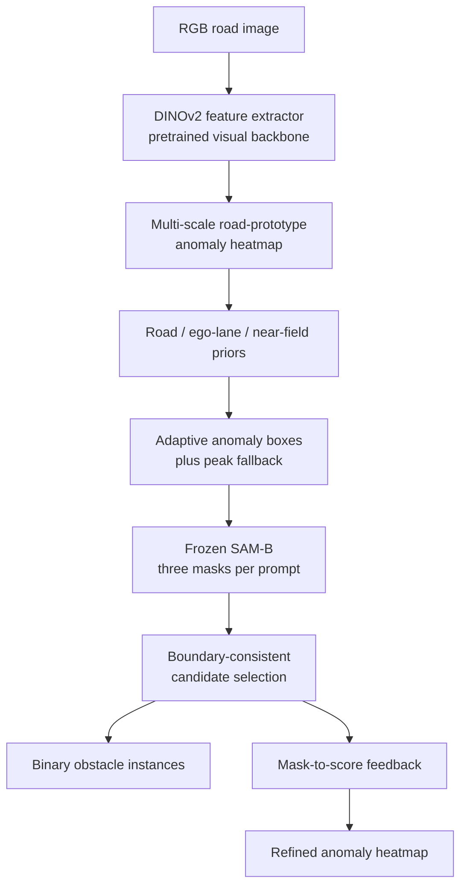

# RiskPrompt-SAM (RaOD-ERAS workspace)

Road-aware SAM prompting and mask feedback for training-free unexpected road-obstacle segmentation.

This repository contains the RiskPrompt-SAM conference-paper experiment, the earlier RaOD-ERAS prototype, a 189-pair unified evaluation archive, paper assets, and reproduction scripts. RiskPrompt-SAM uses a shared DINOv2 anomaly map and SAM-B to compare thresholding, S2M-style box prompting, UGainS-style farthest-point prompting, and the proposed road-aware box selection with mask feedback.

The method is training-free: DINOv2 and SAM-B remain frozen, and no anomaly GT is used during inference. The paper claim is a controlled prompting-mechanism comparison, not superiority over the official end-to-end S2M or UGainS checkpoints.

## Current Status

| Item | Status | Notes |
|---|---|---|
| Core model/framework | Done | `src/raod_eras/` |
| Three-dataset full experiment | Done | 189/189 pairs, frozen protocol |
| Heatmaps and binary masks | Done | Under `outputs/` |
| Warning event output | Done | `warning_events.jsonl` |
| Metrics and paired bootstrap | Done | S2M-style and UGainS-style controlled baselines |
| Paper figures | Done | `paper/figures/` |
| RiskPrompt paper draft | Done | `paper/riskprompt_paper_draft_en.md` |
| Updated CCIS PDF | Pending | Existing PDF still describes the older RaOD-ERAS experiment |
| Unified evaluation archive | Done | `dist/unified_road_anomaly_eval_189.zip` (Git LFS) |
| Submission/release packages | Local build | Generated by the packaging scripts; not tracked |
| Author metadata | Pending | Fill `paper/author_metadata_template.json` before final submission |
| GitHub repository | Published | `songfy0118/RaOD-ERAS` |

## Validated Paper Result

The compact public result is `outputs/riskprompt_full_189/results_summary.json`. Pixel-micro results over all 189 pairs are:

| Method | Precision | Recall | F1 | IoU | AP | FPR95 |
|---|---:|---:|---:|---:|---:|---:|
| Threshold | 0.0312 | 0.5568 | 0.0590 | 0.0304 | 0.0492 | 0.8609 |
| S2M-style | 0.1282 | 0.1223 | 0.1252 | 0.0668 | 0.0492 | 0.8609 |
| UGainS-style | 0.0190 | 0.2889 | 0.0356 | 0.0181 | 0.0458 | 0.8657 |
| **RiskPrompt-SAM** | **0.1601** | 0.1846 | **0.1715** | **0.0938** | **0.0805** | **0.8551** |

Paired image-level bootstrap differences against S2M-style are positive for F1 (`+0.0624`, 95% CI `[0.0494, 0.0758]`) and IoU (`+0.0365`, `[0.0264, 0.0479]`). On SMIYC, RiskPrompt improves AP but is slightly below S2M-style in binary F1/IoU; this trade-off is documented rather than hidden.

## High-Level Framework



## Project Structure

```text
CIVS/
  src/raod_eras/        core reusable algorithm code
  scripts/              command-line entry scripts
  data/                 final local datasets and unified index
  outputs/              final experiment outputs
  paper/                paper draft, figures, tables, references, PDF
  dist/                 unified dataset archive and local build packages
  _archive_unused/      old experiments, unused data, reference code
  README.md             this file
  REPRODUCE.md          detailed reproduction guide
  requirements.txt      Python dependencies
```

## Core Code Files

`src/raod_eras/` contains the actual method implementation.

| File | Purpose |
|---|---|
| `__init__.py` | Python package marker |
| `baselines.py` | RoadContrast baseline heatmap |
| `config.py` | Dataset, method, and output configuration dataclasses |
| `datasets.py` | Loads RGB images, GT masks, valid masks, and sample IDs |
| `dino_features.py` | Loads DINOv2 and computes road-prototype anomaly heatmaps |
| `experiment.py` | Main experiment pipeline: run methods, save outputs, compute metrics |
| `io_utils.py` | Saves JSON, JSONL, CSV, heatmap PNG, and binary mask PNG |
| `metrics.py` | Computes AP, F1, IoU, precision, recall, and FPR95 |
| `object_refinement.py` | Seeded object candidates, boundary filtering, and mask-to-heatmap feedback |
| `priors.py` | Road trapezoid prior, ego-lane prior, near-field prior, normalization |
| `refinement.py` | ERAS variants and connected-component risk refinement |
| `reporting.py` | Markdown tables and visual comparison grids |
| `risk_planning.py` | Image-plane risk map and candidate trajectory scoring |
| `score_to_mask.py` | S2M-style boxes, UGainS-style FPS points, road-aware SAM mask selection, feedback |

## Script Files

`scripts/` contains the runnable commands.

| File | Purpose |
|---|---|
| `run_research_experiment.py` | Main entry point for the three source datasets or the unified archive |
| `build_unified_dataset.py` | Copies images, converts GT to binary masks, and builds 189-sample metadata |
| `make_metric_digest.py` | Generates `paper/tables/quantitative_digest.md` |
| `make_ablation_and_objective_tables.py` | Generates ablation and operating-point selection tables |
| `make_publication_figures.py` | Generates paper qualitative panels and main qualitative figure |
| `make_paper_assets.py` | Generates framework and warning-event paper figures |
| `build_ccis_pdf.py` | Builds the Springer/CCIS PDF from LaTeX |
| `set_paper_metadata.py` | Replaces author, affiliation, and email metadata |
| `prepare_final_submission.py` | Runs metadata replacement, PDF build, packaging, and final checks |
| `package_submission.py` | Builds the CCIS submission zip |
| `package_release.py` | Builds a lightweight GitHub release zip |
| `final_submission_check.py` | Checks PDF, submission package, release package, and author metadata |
| `run_s2m_comparison.py` | Main four-method RiskPrompt-SAM experiment with caching/resume |
| `analyze_prompt_results.py` | Bootstrap confidence intervals and paper-ready tables |
| `make_riskprompt_figure.py` | Success/failure qualitative figure from cached full results |

## Final Datasets

The current experiments use three public source datasets. Their 189 usable image/GT pairs are also standardized into one downloadable archive.

| Dataset | Local folder | Samples with GT | Used in paper | Role |
|---|---|---:|---|---|
| SMIYC RoadObstacle | `data/smiyc_road_obstacle` | 30 | Yes | Main road-obstacle benchmark |
| RoadAnomaly21 | `data/road_anomaly` | 10 | Yes | Cross-dataset anomaly validation |
| StreetHazards partial | `data/street_hazards` | 149 | Yes | Larger partial OOD validation |
| Unified evaluation manifest | `data/unified_road_anomaly_eval` | 189 | Reproduction | Standardized partial split; not a new dataset |

Download the Git LFS archive after cloning:

```powershell
git lfs pull
tar -xf dist\unified_road_anomaly_eval_189.zip
```

The final unified metadata lives here:

```text
data/unified_road_anomaly_eval/metadata/summary.json
data/unified_road_anomaly_eval/metadata/samples.csv
data/unified_road_anomaly_eval/metadata/samples.jsonl
```

The archive contains `images/`, `gt_labels/`, and `metadata/`. Standardized labels use `0=normal`, `1=anomaly`, and `255=ignore`; SMIYC pixels outside the drivable evaluation region remain ignored. These are partial public validation subsets, not complete private benchmark test sets. See `DATASET.md` for provenance and redistribution notes.

Unused Fishyscapes-only mask data, old smoke runs, and reference code were moved to:

```text
_archive_unused/
```

## How To Run

Open the cloned repository folder in PyCharm or a terminal.

Install dependencies:

```powershell
python -m pip install -r requirements.txt
```

Run one image from the downloadable unified archive first:

```powershell
python scripts\run_research_experiment.py --dataset unified --max-samples 1 --out outputs\test_one
```

Run the current paper experiment in the CUDA-enabled `Test2` environment:

```powershell
conda run -n Test2 python scripts\run_s2m_comparison.py --max-samples 1 --out outputs\riskprompt_smoke
conda run -n Test2 python scripts\run_s2m_comparison.py --max-samples 189 --ugains-threshold 0.60 --out outputs\riskprompt_full_189
conda run -n Test2 python scripts\analyze_prompt_results.py outputs\riskprompt_full_189\results.json
conda run -n Test2 python scripts\make_riskprompt_figure.py outputs\riskprompt_full_189\results.json
```

The main runner writes one compressed cache per completed image. Re-running the same command resumes missing samples and does not recompute finished DINOv2/SAM inference.

Run all 189 standardized pairs:

```powershell
python scripts\run_research_experiment.py --dataset unified --out outputs\research_experiment_unified
```

The default run evaluates the six-method core chain and computes primary dataset-level metrics. Use the slower diagnostic options only when needed:

```powershell
python scripts\run_research_experiment.py --dataset unified --max-samples 10 --full-ablations --per-image-metrics
```

The risk-fusion weight is frozen at `0.20`, the binary threshold at `0.70`, and the minimum component ratio at `0.00005`. These values were selected on the deterministic first 10 stratified samples. Final validation must use a non-overlapping offset, for example `--max-samples 20 --sample-offset 10`.

The final method is dual-output: `dino_risk_heatmap` supplies the ranked anomaly heatmap, while the ERAS-balanced branch supplies the fixed-threshold binary mask. The frozen development protocol and disjoint 20-sample results are recorded in `paper/frozen_experiment_protocol.md`.

A CVPR 2024 S2M-style comparison using the official SAM-B checkpoint is implemented in `scripts/run_s2m_comparison.py`. The current same-input Risk-S2M comparison and its claim boundary are documented in `paper/s2m_comparison_status.md`; these are not labeled as official S2M detector results.

The source-specific commands below require the original local `paper_subset` folders:

```powershell
python scripts\run_research_experiment.py --dataset smiyc
python scripts\run_research_experiment.py --dataset road_anomaly
python scripts\run_research_experiment.py --dataset street_hazards --out outputs\research_experiment_street_hazards_149
```

Generate paper tables and figures:

```powershell
python scripts\make_metric_digest.py
python scripts\make_ablation_and_objective_tables.py
python scripts\make_publication_figures.py
```

Build the paper and packages:

```powershell
python scripts\build_ccis_pdf.py
python scripts\package_submission.py
python scripts\package_release.py
python scripts\final_submission_check.py
```

## Output Files

Each experiment writes:

```text
outputs/research_experiment_<dataset>/
  metrics.json              mean per-image exploratory metrics
  aggregate_metrics.json    primary dataset-level pixel metrics
  dataset_breakdown.json    source-wise aggregate metrics for unified runs
  comparison_table.csv      per-image detailed metrics
  warning_events.jsonl      warning boxes and risk scores
  risk_plans.jsonl          trajectory costs and selected rule action
  risk_summary.json         action counts and clearance summary
  ablation_manifest.json    ordered method chain and module definitions
  heatmaps/                 anomaly heatmap PNGs
  binary_masks/             thresholded black-white masks
  object_masks/             separately evaluated object proposals
  reports/result_table.md   readable result table
  reports/method_grid.png   visual comparison grid
```

Current formal output folders:

```text
outputs/research_experiment_smiyc
outputs/research_experiment_road_anomaly
outputs/research_experiment_street_hazards_149
```

These older folders were generated before the current aggregate protocol. They must be rerun before their numbers are used in the submission.

Paper-ready materials:

```text
paper/figures/main_qualitative_figure.png
paper/figures/framework_pipeline.png
paper/figures/warning_event_example.png
paper/tables/quantitative_digest.md
paper/tables/ablation_objective.md
paper/RaOD-ERAS_CCIS_draft.pdf
```

## Metrics

| Metric | Meaning | Direction |
|---|---|---|
| AP | Area under precision-recall curve for anomaly scores | Higher is better |
| F1 | Harmonic mean of precision and recall at selected threshold | Higher is better |
| IoU | Intersection-over-union between predicted mask and GT mask | Higher is better |
| Precision | Predicted anomaly pixels that are truly anomaly | Higher is better |
| Recall | GT anomaly pixels recovered by the prediction | Higher is better |
| FPR95 | False positive rate at 95% true positive rate | Lower is better |

The ablation objective used for operating-point comparison is:

```text
L = 0.40 * (1 - AP) + 0.35 * (1 - F1) + 0.25 * FPR95
```

This is not a neural-network training loss. It is an exploratory validation-time selection objective for a training-free pipeline.

Important: the current F1, IoU, Precision, Recall, and reported thresholds are computed using a per-image best-F1 threshold. AP and FPR95 are also computed per image and then averaged. These numbers are useful for internal comparison but are not official benchmark submissions or deployment metrics. Saved binary masks and warning events use the fixed `--output-threshold` value instead of GT-selected thresholds.

The implemented ablation chain is:

```text
DINO road prototype
  -> DINO multi-scale
  -> risk-guided heatmap
  -> ERAS spatial refinement
  -> seeded object segmentation and mask feedback
  -> image-plane risk planning
```

The object-feedback and trajectory modules remain experimental. A five-sample engineering check improved the risk-guided heatmap but did not validate object feedback as an accuracy improvement. See `paper/closed_loop_experiment_status.md`.

## Claim Boundary

The reported comparison isolates prompting and mask-feedback mechanisms under one shared DINOv2 heatmap and one shared SAM-B. `S2M-style` and `UGainS-style` are mechanism reproductions, not the official trained end-to-end checkpoints. Results are local controlled-comparison scores, not official SegmentMeIfYouCan leaderboard submissions.

## Final Submission

Before final submission, fill:

```text
paper/author_metadata_template.json
```

Then run:

```powershell
python scripts\prepare_final_submission.py --metadata paper\author_metadata_template.json
```

Current known blockers:

```text
Author names, affiliation, and email are still placeholders.
Official benchmark-style aggregate evaluation remains to be completed.
```
