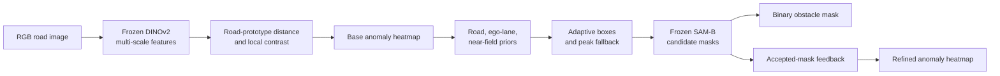

# RiskPrompt-SAM

[English](README.md) | [简体中文](README_CN.md)

RiskPrompt-SAM is a training-free framework for unexpected road-obstacle segmentation. DINOv2 ViT-S/14 and SAM ViT-B are frozen; anomaly ground truth is used only for evaluation, never by inference.

## Status and Claim

The repository contains the final small-conference experiment: a 189-image controlled ablation, three-source analysis, 5,000-replicate paired bootstrap, and an evaluation with the official SegmentMeIfYouCan RoadObstacle validation protocol.

The supported claim is deliberately narrow:

> Road-aware prompting improves object-level binary segmentation, while feedback from accepted SAM masks improves continuous anomaly ranking. The method obtains competitive SMIYC AUPR without anomaly training, but it is not a universal or full-SOTA result.

## Inputs and Outputs

Given one road RGB image, the pipeline returns:

1. a continuous anomaly heatmap, evaluated by AP/AUPR and FPR95;
2. a binary obstacle mask, evaluated by precision, recall, F1, IoU, boundary F1, and component F1;
3. image-plane warning attributes. These are not metric depth, TTC, or closed-loop control predictions.

## Method



DINOv2 provides generic features. A road prototype estimated from lower-image candidate road patches is combined with multi-scale feature distance, local road contrast, and image-plane priors to form a continuous anomaly score.

Instead of converting every high-score component directly into a SAM prompt, RiskPrompt ranks candidates using road overlap, ego-lane overlap, near-field position, and regional anomaly strength, with peak fallback for small obstacles. Accepted SAM masks reinforce object interiors and suppress unsupported scattered responses in the heatmap.

The boundary tie-break is retained only as an implementation detail: its independent gain was not significant on the 189-image ablation.

## Controlled Ablation

Every variant uses the same images, DINOv2 front end, SAM-B, labels, and evaluation code.

| Variant | Road-aware prompts | Boundary tie-break | Mask feedback | Purpose |
|---|:---:|:---:|:---:|---|
| A: basic boxes | No | No | No | shared-front-end box baseline |
| B: road boxes | Yes | No | No | isolates road-aware prompting |
| C: boundary selection | Yes | Yes | No | tests candidate selection |
| D: full method | Yes | Yes | Yes | tests heatmap feedback |

C and D intentionally share the same binary mask. Their difference is evaluated only on continuous heatmap AP/FPR95.

## Data and Protocol

| Source | Image/GT pairs | Role |
|---|---:|---|
| RoadAnomaly | 10 | real-road cross-dataset validation |
| SMIYC RoadObstacle | 30 | primary real obstacle validation |
| StreetHazards partial | 149 | larger synthetic OOD validation |
| Total | 189 | unified controlled-ablation manifest |

Labels are standardized as `0=normal`, `1=anomaly`, and `255=ignore`. The 189-pair manifest is a convenience evaluation index over public subsets, not a new dataset or the full hidden test split of any benchmark.

Ten deterministic development samples were used to check the implementation, followed by a disjoint 20-sample stability check. Parameters were then frozen for all 189 pairs. Inference never reads GT.

## Main Results

Pixel-micro results on all 189 pairs:

| Variant | Precision | Recall | F1 | IoU | AP | FPR95↓ |
|---|---:|---:|---:|---:|---:|---:|
| A: basic boxes | 0.1282 | 0.1223 | 0.1252 | 0.0668 | 0.0492 | 0.8609 |
| B: road boxes | 0.1587 | 0.1834 | 0.1701 | 0.0930 | 0.0492 | 0.8609 |
| C: boundary selection | 0.1593 | 0.1836 | 0.1706 | 0.0932 | 0.0492 | 0.8609 |
| D: full method | **0.1593** | **0.1836** | **0.1706** | **0.0932** | **0.0810** | **0.8551** |

Road-aware prompting improves image-macro F1 by `+0.0615` (95% CI `[0.0488, 0.0748]`) and IoU by `+0.0363` (`[0.0264, 0.0475]`) relative to A. The C-vs-B effect is not significant. Feedback raises pixel-micro AP from `0.0492` to `0.0810` and reduces FPR95 from `0.8609` to `0.8551`.

Official SMIYC `ObstacleTrack-validation` evaluation:

| Method | AUPR↑ | FPR95↓ | GT-sIoU↑ | PPV↑ | mean F1↑ |
|---|---:|---:|---:|---:|---:|
| DINO base heatmap | 69.26 | **1.29** | 24.42 | 68.87 | 35.17 |
| RiskPrompt-SAM | **91.90** | 1.48 | **48.39** | **71.17** | **62.34** |

Feedback substantially improves AUPR and segment metrics, but FPR95 worsens by 0.18 percentage points. This trade-off must remain visible.

## Reproduction

Install dependencies and retrieve Git LFS artifacts:

```powershell
python -m pip install -r requirements.txt
git lfs pull
```

The CUDA environment must contain the SAM ViT-B checkpoint at:

```text
external/S2M_official/tools/sam_vit_b_01ec64.pth
```

### One-image smoke test

```powershell
conda run -n Test2 python scripts\run_s2m_comparison.py --max-samples 1 --out outputs\riskprompt_smoke
conda run -n Test2 python scripts\run_prompt_ablation.py --max-samples 1 --source-cache outputs\riskprompt_smoke\cache --ablation-cache outputs\riskprompt_ablation_smoke_cache --out outputs\riskprompt_ablation_smoke --save-visuals
```

### Disjoint stability checks

```powershell
conda run -n Test2 python scripts\run_prompt_ablation.py --max-samples 10 --source-cache outputs\riskprompt_full_189\cache --out outputs\ablation_calibration_10 --save-visuals
conda run -n Test2 python scripts\run_prompt_ablation.py --max-samples 20 --sample-offset 10 --source-cache outputs\riskprompt_full_189\cache --out outputs\ablation_validation_20 --save-visuals
```

### Full 189-pair experiment

```powershell
conda run -n Test2 python scripts\run_s2m_comparison.py --max-samples 189 --ugains-threshold 0.60 --out outputs\riskprompt_full_189
conda run -n Test2 python scripts\run_prompt_ablation.py --max-samples 189 --source-cache outputs\riskprompt_full_189\cache --out outputs\riskprompt_ablation_full_189_v2 --save-visuals
conda run -n Test2 python scripts\analyze_ablation_results.py outputs\riskprompt_ablation_full_189_v2\results.json
```

Runs are cached per image and resume from existing cache files.

### Official SMIYC protocol

```powershell
conda run -n Test2 python scripts\evaluate_smiyc_official.py --method-name RiskPromptSAM-v2 --cache outputs\riskprompt_ablation_cache --score-key feedback_score
```

This step requires `external/road-anomaly-benchmark` and its configured `ObstacleTrack-validation` data.

## Key Paths

```text
src/raod_eras/dino_features.py             DINOv2 road-prototype heatmap
src/raod_eras/score_to_mask.py             prompts, SAM selection, feedback
src/raod_eras/metrics.py                   pixel, component, boundary metrics
scripts/run_s2m_comparison.py              shared-front-end cache and baselines
scripts/run_prompt_ablation.py             final A-D ablation entry point
scripts/analyze_ablation_results.py        paired bootstrap and report
scripts/evaluate_smiyc_official.py          official SMIYC evaluation
outputs/riskprompt_ablation_full_189_v2/    final controlled experiment
outputs/smiyc_official_protocol/            official protocol results
paper/RiskPrompt-SAM_中文论文初稿.docx       Chinese paper draft
```

## Limitations

The current evidence supports a small conference paper, not a journal-level or universal SOTA claim. Limitations include mixed cross-dataset behavior, a fixed image-plane road prior, only 189 locally available public pairs, and no depth, TTC, trajectory, or risk ground truth. The warning output is therefore an interpretable image-plane application layer, not validated vehicle control.
