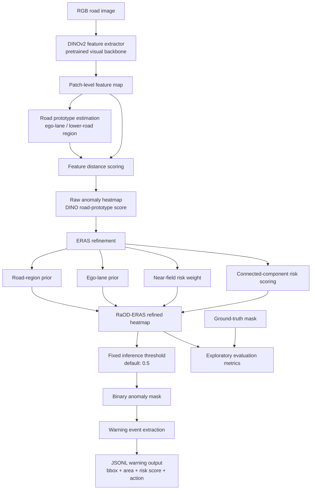

# RaOD-ERAS

Road-Prototype Anomaly Heatmap with Ego-Lane Risk-Aware Refinement for Unexpected Road Obstacle Segmentation.

This repository contains the current RaOD-ERAS research prototype and CCIS paper draft. The code, a 189-pair unified evaluation archive, exploratory experiments, tables, figures, and packaging scripts are available. Author metadata and official benchmark-style validation are still pending.

The method is a training-free road anomaly segmentation and warning pipeline. It uses pretrained DINOv2 features, then adds a road-prototype anomaly score and ERAS ego-lane risk refinement. It does not train a new segmentation backbone from scratch.

## Current Status

| Item | Status | Notes |
|---|---|---|
| Core model/framework | Done | `src/raod_eras/` |
| Three-dataset experiments | Done | SMIYC, RoadAnomaly21, StreetHazards partial |
| Heatmaps and binary masks | Done | Under `outputs/` |
| Warning event output | Done | `warning_events.jsonl` |
| Metrics and ablation tables | Done | `paper/tables/` |
| Paper figures | Done | `paper/figures/` |
| CCIS draft PDF | Done | `paper/RaOD-ERAS_CCIS_draft.pdf` |
| Unified evaluation archive | Done | `dist/unified_road_anomaly_eval_189.zip` (Git LFS) |
| Submission/release packages | Local build | Generated by the packaging scripts; not tracked |
| Author metadata | Pending | Fill `paper/author_metadata_template.json` before final submission |
| GitHub repository | Published | `songfy0118/RaOD-ERAS` |

## High-Level Framework



## Project Structure

```text
CIVS/
  src/raod_eras/        core reusable algorithm code
  scripts/              command-line entry scripts
  data/                 final local datasets and unified index
  outputs/              final experiment outputs
  paper/                paper draft, figures, tables, references, PDF
  dist/                 unified dataset archive and local build packages
  _archive_unused/      old experiments, unused data, reference code
  README.md             this file
  REPRODUCE.md          detailed reproduction guide
  requirements.txt      Python dependencies
```

## Core Code Files

`src/raod_eras/` contains the actual method implementation.

| File | Purpose |
|---|---|
| `__init__.py` | Python package marker |
| `baselines.py` | RoadContrast baseline heatmap |
| `config.py` | Dataset, method, and output configuration dataclasses |
| `datasets.py` | Loads RGB images, GT masks, valid masks, and sample IDs |
| `dino_features.py` | Loads DINOv2 and computes road-prototype anomaly heatmaps |
| `experiment.py` | Main experiment pipeline: run methods, save outputs, compute metrics |
| `io_utils.py` | Saves JSON, JSONL, CSV, heatmap PNG, and binary mask PNG |
| `metrics.py` | Computes AP, F1, IoU, precision, recall, and FPR95 |
| `priors.py` | Road trapezoid prior, ego-lane prior, near-field prior, normalization |
| `refinement.py` | ERAS variants and connected-component risk refinement |
| `reporting.py` | Markdown tables and visual comparison grids |

## Script Files

`scripts/` contains the runnable commands.

| File | Purpose |
|---|---|
| `run_research_experiment.py` | Main entry point for the three source datasets or the unified archive |
| `build_unified_dataset.py` | Copies images, converts GT to binary masks, and builds 189-sample metadata |
| `make_metric_digest.py` | Generates `paper/tables/quantitative_digest.md` |
| `make_ablation_and_objective_tables.py` | Generates ablation and operating-point selection tables |
| `make_publication_figures.py` | Generates paper qualitative panels and main qualitative figure |
| `make_paper_assets.py` | Generates framework and warning-event paper figures |
| `build_ccis_pdf.py` | Builds the Springer/CCIS PDF from LaTeX |
| `set_paper_metadata.py` | Replaces author, affiliation, and email metadata |
| `prepare_final_submission.py` | Runs metadata replacement, PDF build, packaging, and final checks |
| `package_submission.py` | Builds the CCIS submission zip |
| `package_release.py` | Builds a lightweight GitHub release zip |
| `final_submission_check.py` | Checks PDF, submission package, release package, and author metadata |

## Final Datasets

The current experiments use three public source datasets. Their 189 usable image/GT pairs are also standardized into one downloadable archive.

| Dataset | Local folder | Samples with GT | Used in paper | Role |
|---|---|---:|---|---|
| SMIYC RoadObstacle | `data/smiyc_road_obstacle` | 30 | Yes | Main road-obstacle benchmark |
| RoadAnomaly21 | `data/road_anomaly` | 10 | Yes | Cross-dataset anomaly validation |
| StreetHazards partial | `data/street_hazards` | 149 | Yes | Larger partial OOD validation |
| Unified evaluation set | `data/unified_road_anomaly_eval` | 189 | Reproduction | Standardized combined evaluation set |

Download the Git LFS archive after cloning:

```powershell
git lfs pull
tar -xf dist\unified_road_anomaly_eval_189.zip
```

The final unified metadata lives here:

```text
data/unified_road_anomaly_eval/metadata/summary.json
data/unified_road_anomaly_eval/metadata/samples.csv
data/unified_road_anomaly_eval/metadata/samples.jsonl
```

Unused Fishyscapes-only mask data, old smoke runs, and reference code were moved to:

```text
_archive_unused/
```

## How To Run

Open the cloned repository folder in PyCharm or a terminal.

Install dependencies:

```powershell
python -m pip install -r requirements.txt
```

Run one image from the downloadable unified archive first:

```powershell
python scripts\run_research_experiment.py --dataset unified --max-samples 1 --out outputs\test_one
```

Run all 189 standardized pairs:

```powershell
python scripts\run_research_experiment.py --dataset unified --out outputs\research_experiment_unified
```

The source-specific commands below require the original local `paper_subset` folders:

```powershell
python scripts\run_research_experiment.py --dataset smiyc
python scripts\run_research_experiment.py --dataset road_anomaly
python scripts\run_research_experiment.py --dataset street_hazards --out outputs\research_experiment_street_hazards_149
```

Generate paper tables and figures:

```powershell
python scripts\make_metric_digest.py
python scripts\make_ablation_and_objective_tables.py
python scripts\make_publication_figures.py
```

Build the paper and packages:

```powershell
python scripts\build_ccis_pdf.py
python scripts\package_submission.py
python scripts\package_release.py
python scripts\final_submission_check.py
```

## Output Files

Each experiment writes:

```text
outputs/research_experiment_<dataset>/
  metrics.json              averaged metrics over the dataset
  comparison_table.csv      per-image detailed metrics
  warning_events.jsonl      warning boxes and risk scores
  heatmaps/                 anomaly heatmap PNGs
  binary_masks/             thresholded black-white masks
  reports/result_table.md   readable result table
  reports/method_grid.png   visual comparison grid
```

Current formal output folders:

```text
outputs/research_experiment_smiyc
outputs/research_experiment_road_anomaly
outputs/research_experiment_street_hazards_149
```

Paper-ready materials:

```text
paper/figures/main_qualitative_figure.png
paper/figures/framework_pipeline.png
paper/figures/warning_event_example.png
paper/tables/quantitative_digest.md
paper/tables/ablation_objective.md
paper/RaOD-ERAS_CCIS_draft.pdf
```

## Metrics

| Metric | Meaning | Direction |
|---|---|---|
| AP | Area under precision-recall curve for anomaly scores | Higher is better |
| F1 | Harmonic mean of precision and recall at selected threshold | Higher is better |
| IoU | Intersection-over-union between predicted mask and GT mask | Higher is better |
| Precision | Predicted anomaly pixels that are truly anomaly | Higher is better |
| Recall | GT anomaly pixels recovered by the prediction | Higher is better |
| FPR95 | False positive rate at 95% true positive rate | Lower is better |

The ablation objective used for operating-point comparison is:

```text
L = 0.40 * (1 - AP) + 0.35 * (1 - F1) + 0.25 * FPR95
```

This is not a neural-network training loss. It is an exploratory validation-time selection objective for a training-free pipeline.

Important: the current F1, IoU, Precision, Recall, and reported thresholds are computed using a per-image best-F1 threshold. AP and FPR95 are also computed per image and then averaged. These numbers are useful for internal comparison but are not official benchmark submissions or deployment metrics. Saved binary masks and warning events use the fixed `--output-threshold` value instead of GT-selected thresholds.

## Current Exploratory Result

Not all datasets and not all metrics improve. This is important.

| Dataset | Best method / result | Honest interpretation |
|---|---|---|
| SMIYC RoadObstacle | `dino_eras_light` | Improves AP, F1, Recall, and FPR95 over raw DINOv2; IoU/Precision are slightly lower |
| RoadAnomaly21 | `dino_eras_balanced` | Clearly improves AP, F1, IoU, Precision, Recall, and FPR95 over raw DINOv2 |
| StreetHazards partial | raw `dino` for AP/F1; ERAS for Recall/FPR95 | ERAS improves Recall and FPR95 but lowers AP/F1/IoU/Precision |

Detailed table:

| Dataset | Method | AP | F1 | IoU | Precision | Recall | FPR95 |
|---|---|---:|---:|---:|---:|---:|---:|
| SMIYC | dino | 0.5203 | 0.5228 | 0.3998 | 0.4781 | 0.6864 | 0.0268 |
| SMIYC | dino_eras_light | 0.5271 | 0.5232 | 0.3989 | 0.4693 | 0.7524 | 0.0256 |
| RoadAnomaly21 | dino | 0.1324 | 0.3119 | 0.1907 | 0.1924 | 0.9314 | 0.6749 |
| RoadAnomaly21 | dino_eras_balanced | 0.3227 | 0.4782 | 0.3289 | 0.3640 | 0.8369 | 0.5592 |
| StreetHazards partial | dino | 0.1133 | 0.1588 | 0.0975 | 0.1424 | 0.4781 | 0.3671 |
| StreetHazards partial | dino_eras_light | 0.0691 | 0.1344 | 0.0753 | 0.1077 | 0.5177 | 0.2688 |

Correct paper claim:

```text
RaOD-ERAS is a lightweight, training-free, risk-aware road anomaly warning framework.
It improves risk-oriented behavior on SMIYC and RoadAnomaly21, and shows a recall/FPR95 trade-off on StreetHazards.
```

Incorrect claim:

```text
RaOD-ERAS improves every metric on every dataset.
```

## Final Submission

Before final submission, fill:

```text
paper/author_metadata_template.json
```

Then run:

```powershell
python scripts\prepare_final_submission.py --metadata paper\author_metadata_template.json
```

Current known blockers:

```text
Author names, affiliation, and email are still placeholders.
Official benchmark-style aggregate evaluation remains to be completed.
```
