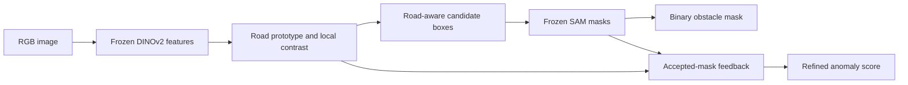

# RPSAN / RiskPrompt-SAM

**Road-aware prompting and mask feedback for unknown road-obstacle segmentation.**

[English](README.md) · [简体中文](README_CN.md) · [Run instructions](REPRODUCE.md) · [Experiment results](docs/RESULTS.md) · [Validation](docs/VALIDATION.md)

RPSAN investigates how frozen DINOv2 features and Segment Anything can identify unexpected road obstacles without anomaly-specific model training. Road-aware prompts guide SAM toward candidate objects; accepted-mask feedback refines the continuous anomaly map.

The repository keeps its historical URL, `RaOD-ERAS`. The public implementation and result files use **RiskPrompt-SAM**, an experimental version of the RPSAN research project. This release documents that public snapshot; it does not claim to reproduce every experiment in later manuscript revisions.

## Try one image

Use Python 3.10+ and run commands from the repository root. Install a PyTorch/torchvision build appropriate for your CPU or CUDA environment, then:

```bash
git clone https://github.com/songfy0118/RaOD-ERAS.git
cd RaOD-ERAS
python -m pip install -r requirements.txt
python -m unittest discover -s tests -v
python scripts/predict_image.py --help
```

Download the **SAM ViT-B** checkpoint from the [official Segment Anything repository](https://github.com/facebookresearch/segment-anything#model-checkpoints). Pass its path and any road image:

```bash
python scripts/predict_image.py --image path/to/road.jpg --sam-checkpoint path/to/sam_vit_b_01ec64.pth --out outputs/example
```

This path needs **no label mask or benchmark dataset**. DINOv2 ViT-S/14 is loaded through the [official DINOv2 Torch Hub entry](https://github.com/facebookresearch/dinov2); first use requires network access and disk space for its code and weights. Later runs use the local cache. CPU is supported; a GPU is recommended.

The output folder contains:

| File | Content |
|---|---|
| `mask.png` | Binary obstacle mask, 0/255 |
| `overlay.png` | Mask over the input image |
| `anomaly.png` | Refined anomaly heatmap |
| `scores.npz` | Base score, refined score and boolean mask arrays |
| `result.json` | Input/output sizes, device, timing, prompt boxes and method scope |

The default longest-side limit is 1,024 pixels. Output arrays match the processed image, not necessarily the original size; use `--max-side 0` for native resolution. Timing excludes model loading and output encoding.

## Method


```mermaid
flowchart LR
    A[RGB image] --> B[Frozen DINOv2 features]
    B --> C[Road prototype and local contrast]
    C --> D[Road-aware candidate boxes]
    D --> E[Frozen SAM masks]
    E --> F[Binary obstacle mask]
    E --> G[Accepted-mask feedback]
    C --> G
    G --> H[Refined anomaly score]
```

The single-image entry runs the public **D: full feedback** ablation. The A–D study isolates road-aware prompts, a boundary tie-break, and accepted-mask feedback. C and D share the same binary mask; feedback changes continuous ranking only. The boundary tie-break did not show a significant independent gain in the stored study.

## Evidence and limits

The archived controlled experiment covers **189 image/label pairs**: 10 RoadAnomaly, 30 SMIYC RoadObstacle validation and 149 StreetHazards images. Stored reports also include the official SMIYC validation protocol. See [the full tables and trade-offs](docs/RESULTS.md); these are historical reported results, not new measurements from the single-image example.

Ground truth is used only for evaluation. Road priors are fixed image-plane heuristics. Outputs are not metric distance, time-to-collision or validated vehicle-control commands. A successful example demonstrates software execution, not benchmark accuracy or deployment readiness.

## Navigate the code

- [src/raod_eras/inference.py](src/raod_eras/inference.py): image-to-score and image-to-mask API.
- [src/raod_eras/score_to_mask.py](src/raod_eras/score_to_mask.py): prompt generation, SAM selection and feedback.
- [src/raod_eras/dino_features.py](src/raod_eras/dino_features.py): feature extraction and road prototypes.
- [scripts/run_prompt_ablation.py](scripts/run_prompt_ablation.py): controlled A–D evaluation.
- [scripts/evaluate_smiyc_official.py](scripts/evaluate_smiyc_official.py): external official evaluator integration.
- [PROJECT_STRUCTURE.md](PROJECT_STRUCTURE.md): data, code and results map.

## Attribution

DINOv2, Segment Anything, S2M-style/UGainS-style comparisons and the source datasets retain their upstream licenses and attribution. Style-based comparisons in this repository are not official end-to-end baseline reproductions. No new blanket license for third-party code, weights or data is asserted.
