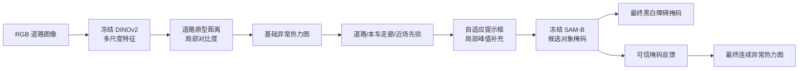

# RiskPrompt-SAM

[English](README.md) | [简体中文](README_CN.md)

面向自动驾驶未知道路障碍的训练自由异常分割。系统冻结 DINOv2 ViT-S/14 与 SAM ViT-B，不使用异常 GT 训练模型；GT 只参与最终评测。

## 当前结论

项目已完成代码框架、189 张受控消融、三数据源分析、5000 次配对 bootstrap 和 SMIYC 官方协议验证，可支撑小型 EI 会议论文。合理主张是：

> 道路感知提示稳定改善对象级二值分割；可信 SAM 掩码反馈显著改善连续异常热力图排序。方法在训练自由条件下取得有竞争力的 SMIYC AUPR，但不宣称全面超过训练式 SOTA。

## 输入与输出

输入是一张道路 RGB 图像，输出三类结果：

1. **异常热力图**：每个像素的连续异常分数，用 AP、AUPR 和 FPR95 评估。
2. **黑白障碍掩码**：可直接使用的对象区域，用 Precision、Recall、F1、IoU、边界 F1 和组件 F1 评估。
3. **图像平面预警属性**：实例位置、面积和规则风险分数；当前不代表真实距离、TTC 或车辆控制指令。

## 方法思路



### 1. 基础热力图

DINOv2 只负责提取通用图像特征。系统从图像下部候选道路区域估计道路特征原型，再融合多尺度原型距离、局部道路对比度和图像平面先验，得到连续异常分数。高分表示该像素与正常道路特征差异较大。

### 2. 道路感知 SAM 提示

普通方法只把热力图高分连通域转换成提示框。本方法还根据道路重叠、本车走廊、近场位置和区域异常均值排序候选，并通过局部峰值补充小障碍提示，再由 SAM 恢复完整轮廓。

### 3. 候选选择与掩码反馈

SAM 对每个框输出多个候选掩码。代码在最高 SAM 置信度附近使用“掩码内部异常值减去外部边界异常值”做受限平分；该规则在 189 张实验中的独立增益不显著，因此只作为实现细节，不列为主要创新。

可信掩码随后反馈到连续热力图：增强对象内部响应，抑制没有实例支持的零散响应。黑白掩码保持不变，因此该步骤只应通过 AP/FPR95 判断，不能用二值 F1 重复计功。

## 实验逻辑

所有变体使用完全相同的 189 张图像、DINOv2 前端、SAM-B、GT 和评测代码，仅顺序增加模块：

| 变体 | 道路感知提示 | 边界平分 | 掩码反馈 | 检验目的 |
|---|:---:|:---:|:---:|---|
| A：基础框 | 否 | 否 | 否 | 共享前端下的普通框基线 |
| B：道路框 | 是 | 否 | 否 | 单独验证道路感知提示 |
| C：边界选择 | 是 | 是 | 否 | 检查候选选择规则 |
| D：完整方法 | 是 | 是 | 是 | 检查掩码反馈后的热力图 |

C 与 D 故意共享同一张黑白掩码；二者的差异只看连续热力图 AP/FPR95。

## 数据与协议

| 数据源 | 有效图像/GT | 作用 |
|---|---:|---|
| RoadAnomaly | 10 | 真实道路跨数据验证 |
| SMIYC RoadObstacle | 30 | 主要真实道路障碍验证 |
| StreetHazards partial | 149 | 更大规模的合成 OOD 验证 |
| 合计 | 189 | 统一受控消融清单 |

统一标签为 `0=正常`、`1=异常`、`255=忽略`。189 张清单只是三个公开子集的统一评测入口，不是本文发布的新数据集，也不是三个官方完整隐藏测试集。

实验顺序为：固定 10 张开发样本检查实现；使用不重叠的 20 张样本检查稳定性；冻结参数后运行全部 189 张。推理代码不读取 GT。

## 主要结果

189 张像素微平均结果：

| 变体 | Precision | Recall | F1 | IoU | AP | FPR95↓ |
|---|---:|---:|---:|---:|---:|---:|
| A：基础框 | 0.1282 | 0.1223 | 0.1252 | 0.0668 | 0.0492 | 0.8609 |
| B：道路框 | 0.1587 | 0.1834 | 0.1701 | 0.0930 | 0.0492 | 0.8609 |
| C：边界选择 | 0.1593 | 0.1836 | 0.1706 | 0.0932 | 0.0492 | 0.8609 |
| D：完整方法 | **0.1593** | **0.1836** | **0.1706** | **0.0932** | **0.0810** | **0.8551** |

相对 A：

- 道路感知提示的图像宏平均 F1 增益为 `+0.0615`，95% CI `[0.0488, 0.0748]`。
- IoU 增益为 `+0.0363`，95% CI `[0.0264, 0.0475]`。
- C 相对 B 的独立增益不显著，因此不作为主要贡献。
- D 将像素微平均 AP 从 `0.0492` 提高到 `0.0810`，FPR95 从 `0.8609` 降到 `0.8551`。

SMIYC 官方 `ObstacleTrack-validation` 协议：

| 方法 | AUPR↑ | FPR95↓ | GT-sIoU↑ | PPV↑ | mean F1↑ |
|---|---:|---:|---:|---:|---:|
| DINO 基础热力图 | 69.26 | **1.29** | 24.42 | 68.87 | 35.17 |
| RiskPrompt-SAM | **91.90** | 1.48 | **48.39** | **71.17** | **62.34** |

反馈显著改善 AUPR 和对象级指标，但 FPR95 恶化 `0.18` 个百分点。论文必须保留这一权衡，不能写成所有指标全面提升。

## 指标怎么理解

| 指标 | 对象 | 含义 |
|---|---|---|
| AP/AUPR | 连续热力图 | 异常像素整体排序质量，越高越好 |
| FPR95 | 连续热力图 | 召回 95% 异常时误报了多少正常像素，越低越好 |
| Precision | 黑白掩码 | 预测为障碍的像素中有多少正确 |
| Recall | 黑白掩码 | GT 障碍像素中有多少被找回 |
| F1 | 黑白掩码 | Precision 与 Recall 的平衡 |
| IoU | 黑白掩码 | 预测区域与 GT 的空间重叠 |
| 组件/边界 F1 | 对象掩码 | 障碍实例是否完整、轮廓是否贴合 |

所有指标都是预测与公开 GT 比较得到。所谓“比基础方法提高”，是指在相同图像、相同 GT 和相同评测程序下，改进预测相对基础预测的差值，不是与 GT 自身比较。

## 运行路径

### 1. 安装

```powershell
python -m pip install -r requirements.txt
git lfs pull
```

需要 NVIDIA CUDA 环境以及 SAM ViT-B 权重：

```text
external/S2M_official/tools/sam_vit_b_01ec64.pth
```

### 2. 先跑一张

先生成共享 DINOv2/SAM 基线缓存：

```powershell
conda run -n Test2 python scripts\run_s2m_comparison.py --max-samples 1 --out outputs\riskprompt_smoke
```

再运行 A-D 消融并保存热力图和黑白图：

```powershell
conda run -n Test2 python scripts\run_prompt_ablation.py --max-samples 1 --source-cache outputs\riskprompt_smoke\cache --ablation-cache outputs\riskprompt_ablation_smoke_cache --out outputs\riskprompt_ablation_smoke --save-visuals
```

### 3. 稳定性检查

共享缓存存在后，先运行前 10 张，再运行不重叠的后 20 张：

```powershell
conda run -n Test2 python scripts\run_prompt_ablation.py --max-samples 10 --source-cache outputs\riskprompt_full_189\cache --out outputs\ablation_calibration_10 --save-visuals
conda run -n Test2 python scripts\run_prompt_ablation.py --max-samples 20 --sample-offset 10 --source-cache outputs\riskprompt_full_189\cache --out outputs\ablation_validation_20 --save-visuals
```

### 4. 正式 189 张实验

```powershell
conda run -n Test2 python scripts\run_s2m_comparison.py --max-samples 189 --ugains-threshold 0.60 --out outputs\riskprompt_full_189
conda run -n Test2 python scripts\run_prompt_ablation.py --max-samples 189 --source-cache outputs\riskprompt_full_189\cache --out outputs\riskprompt_ablation_full_189_v2 --save-visuals
conda run -n Test2 python scripts\analyze_ablation_results.py outputs\riskprompt_ablation_full_189_v2\results.json
```

运行器会缓存每张图；同一命令重新执行时会复用已有缓存。

### 5. SMIYC 官方协议

```powershell
conda run -n Test2 python scripts\evaluate_smiyc_official.py --method-name RiskPromptSAM-v2 --cache outputs\riskprompt_ablation_cache --score-key feedback_score
```

该步骤依赖 `external/road-anomaly-benchmark` 和官方 `ObstacleTrack-validation` 数据配置。

## 输出路径

```text
outputs/riskprompt_ablation_full_189_v2/results.json
outputs/riskprompt_ablation_full_189_v2/masks/               # A-D 黑白图
outputs/riskprompt_ablation_full_189_v2/heatmaps/            # 基础/反馈热力图
outputs/riskprompt_ablation_full_189_v2/reports/ablation_report.md
outputs/smiyc_official_protocol/                             # 官方协议结果
paper/RiskPrompt-SAM_中文论文初稿.docx
paper/RiskPrompt-SAM_中文论文初稿.pdf
```

## 核心代码

| 文件 | 作用 |
|---|---|
| `src/raod_eras/dino_features.py` | DINOv2 特征和道路原型异常热力图 |
| `src/raod_eras/score_to_mask.py` | 提示框、SAM 候选选择和掩码反馈 |
| `src/raod_eras/metrics.py` | 像素、对象和边界指标 |
| `scripts/run_s2m_comparison.py` | 共享前端与受控基线缓存 |
| `scripts/run_prompt_ablation.py` | A-D 顺序消融主入口 |
| `scripts/analyze_ablation_results.py` | 5000 次配对 bootstrap 与表格 |
| `scripts/evaluate_smiyc_official.py` | SMIYC 官方协议评测 |

## 论文边界

当前版本适合小型会议，不是顶刊完成版。已知不足包括跨数据集指标不完全一致、固定图像平面道路先验、189 张本地公开样本规模有限，以及没有深度、TTC、轨迹或真实风险 GT。风险输出只能称为图像平面预警，不能称为真实自动驾驶控制验证。
